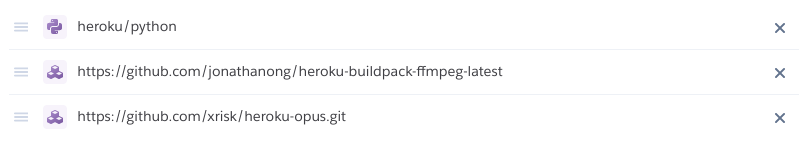

<h1 align="center">Discord Music Bot</h1>

<p align="center">
    <a href="https://github.com/murilo-toddy/discordbot/commits/main">
    
    </a>
    <a href="https://github.com/murilo-toddy/discordbot/graphs/contributors">
    
    </a>
    <a href="https://github.com/murilo-toddy/discordbot/commits/main">
    
    </a>
</p>

A music bot that plays songs from Youtube or Spotify. Bot uses '!' as commands prefix, and a list of
all commands can be found using `!help`.


## Configuration

Data for bot configuration has to be specified as a `.env` file or by the use of environment
variables.

You must provide your discord bot token, your ID to a verified Spotify API account
and as many Youtube API keys as you wish. File formatting should be as follows:

```
DISCORD_TOKEN =
SPOTIFY_ID =
SPOTIFY_SECRET =
YOUTUBE_API_KEY1 = 
YOUTUBE_API_KEY2 = 
...
```

If you wish, you can also create a `cookies.txt` file containing cookie information from your browser.
This cookie authentification is used to remove age restriction from certain songs.

## Dependencies

This bot depends on various APIs and libraries that are specified in the `requirements.txt` file.
Also, you need to have `ffmpeg` installed in your machine.

## Execution

Executing the bot is as simple as running `$ python3 main.py` in the project's directory.

## Hosting

At the moment, this bot is being hosted using `Heroku` services. The configuration step is similar to the
one specified above. These are the buildpacks required by the bot:


